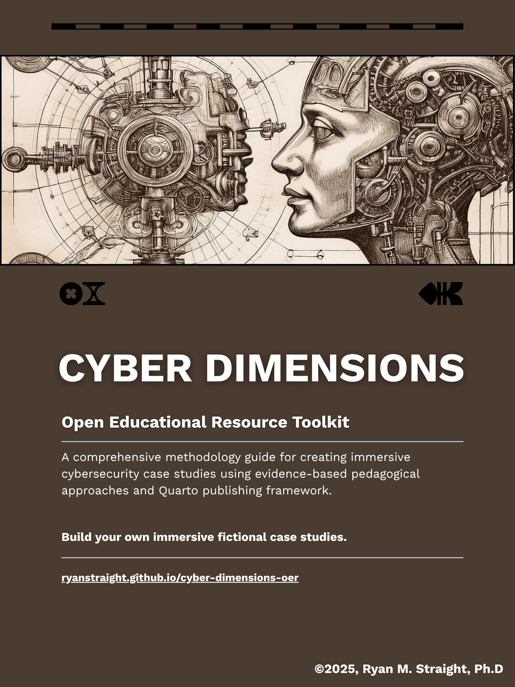

# Cyber Dimensions: Open Educational Resource Toolkit


**Learn the Methodology Behind Immersive Cybersecurity Case Studies**


<a href="https://github.com/ryanstraight/cyber-dimensions-oer/blob/main/assets/images/Straight-Cyber_Dimensions-OER-portrait_cover.png"></a>

This Open Educational Resource (OER) is a comprehensive **methodology
guide** that teaches you how to create immersive, fictional
cybersecurity case studies for your classroom. This Quarto book
documents the proven “Cyber Dimensions” approach, providing detailed
explanations, examples, and frameworks to help you understand and apply
this educational methodology in your own context.

The *Cyber Dimensions* toolkit will be released to coincide with the
*Cyber Dimensions* text from Kendall Hunt, scheduled for August 2025.
This Open Educational Resource (OER) will be available at
[ryanstraight.github.io/cyber-dimensions-oer](https://ryanstraight.github.io/cyber-dimensions-oer).


### Supplemental to Published Textbook

This OER guide is the companion resource to **“Cyber Dimensions:
Immersive Case Studies Across Digital Domains”** published by Kendall
Hunt. While the textbook provides complete case studies, assessments,
and instructional guides ready for classroom use, this methodology guide
explains how those case studies were developed and how you can apply the
same approaches to create your own immersive scenarios.

## Why Learn This Methodology?

This approach has been tested across multiple institutions and refined
through systematic implementation. The methodology offers several
advantages over traditional case study development:

- Based on successful case studies used at University of Arizona and
  other institutions
- Grounded in constructivist learning theory and problem-based learning
  research  
- Provides adaptable framework for diverse institutional contexts and
  learning objectives
- Enables deep understanding of both theory and practice behind
  immersive educational design

## What’s Included

This comprehensive **methodology guide** is structured as a **Quarto
book** with enhanced features including custom extensions, comprehensive
cross-referencing, and professional theming. The guide includes 17+
chapters across 5 major parts:

### Methodology Documentation

The guide covers methodology foundations, theoretical background, and
tutorial walkthroughs. Development framework sections address
worldbuilding principles, character development, and narrative design
theory. Technical implementation chapters explain Quarto integration,
styling approaches, and multimedia considerations. Quality assurance
processes ensure assessment framework design and cross-case continuity.

### Examples and Templates

Sample excerpts from published case studies demonstrate methodology in
practice. Assessment approaches and rubric designs provide concrete
implementation models. Character development and narrative structure
examples illustrate effective techniques.

### Technical Documentation

Visual design choices from the published case studies are explained in
detail. Modern CSS/SCSS approaches with consolidated theming ensure
consistent styling across all outputs. Accessibility considerations
(WCAG 2.1 AA compliance) and responsive design principles guide
implementation decisions. The project includes custom Quarto extensions
for enhanced callouts and bibliography management.

### References and Bibliography

A dedicated references chapter centralizes all academic citations
supporting the methodology. Automated bibliography generation through
Quarto’s citation system ensures consistent academic formatting
throughout the guide.

## Getting Started

### Quick Start

1.  Visit the published guide when released at
    [ryanstraight.github.io/cyber-dimensions-oer](https://ryanstraight.github.io/cyber-dimensions-oer)
    (scheduled August 2025)
2.  Begin with the Introduction to understand the methodology overview
3.  Read Chapter 1: Methodology to grasp the theoretical foundations
4.  Explore the examples to see the approach in practice

### For Developers/Contributors

If you’d like to work with the source files directly, follow these steps
to set up the project locally:

1.  Clone this repository to work with the source files
2.  Install R & Quarto (if not already installed)
3.  Open .Rproj in RStudio (recommended; VS Code, Positron, and other
    IDEs also work)
4.  Run `quarto render` to build the guide locally
5.  Open `docs/index.html` to view your local build

### Learning Path

1.  Study the Methodology to understand the theoretical framework
2.  Review the Tutorial to see the process step-by-step
3.  Examine the Examples to study how theory translates to practice
4.  Apply to Your Context by adapting the methodology to your specific
    needs

## The “Cyber Dimensions” Approach

This methodology guide documents and explains the approach used to
create “Cyber Dimensions: Immersive Case Studies Across Digital
Domains” - a comprehensive text featuring 7 interconnected case studies
used at the University of Arizona to teach Cyber Ethics, Law, and
Policy.

The methodology rests on five core principles:

- Immersive Fiction: Create believable, engaging scenarios without
  real-world bias
- Interconnected Narratives: Build a consistent fictional world
- Multiple Perspectives: Include diverse viewpoints and stakeholders
- Realistic Complexity: Mirror real-world ethical dilemmas
- Flexible Assessment: Support various learning styles and objectives

## License


This OER toolkit is released under [Creative Commons Attribution 4.0
International License (CC BY
4.0)](https://creativecommons.org/licenses/by/4.0/).

You are free to:

- **Share** — copy and redistribute the material
- **Adapt** — remix, transform, and build upon the material
- Use for any purpose, including commercial use

**Attribution** — You must give appropriate credit , provide a link to
the license, and indicate if changes were made . You may do so in any
reasonable manner, but not in any way that suggests the licensor
endorses you or your use.

**No additional restrictions** — You may not apply legal terms or
technological measures that legally restrict others from doing anything
the license permits.

## Citation

BibTeX citations for the toolkit:

``` bibtex
@software{straightCyberDimensionsToolkit2025,
  author = {Straight, Ryan M.},
  title = {Cyber Dimensions: Open Educational Resource Toolkit},
  year = {2025},
  publisher = {GitHub},
  url = {https://github.com/ryanstraight/cyber-dimensions-oer},
  note = {Open Educational Resource for developing immersive cybersecurity case studies}
}
```

> Straight, R. M. (2025). Cyber Dimensions: Open Educational Resource
> Toolkit \[Computer software\]. GitHub.
> https://github.com/ryanstraight/cyber-dimensions-oer

And the Kendall Hunt textbook:

``` bibtex
@book{straightCyberDimensionsImmersive2025,
  title = {Cyber {{Dimensions}}: {{Immersive Case Studies Across Digital Domains}}},
  shorttitle = {Cyber {{Dimensions}}},
  author = {Straight, Ryan},
  year = {2025},
  edition = {1st},
  publisher = {Kendall Hunt},
  isbn = {979-8-3851-8653-2}
}
```

> Straight, R. (2025). Cyber Dimensions: Immersive Case Studies Across
> Digital Domains (1st ed.). Kendall Hunt.

## Technical Features

This toolkit is built using the same platform–Quarto–used to develop the
published textbook, allowing for:

- **Multi-format output**: HTML, PDF, DOCX, ePub, and more formats from
  single source with consistent styling
- **Advanced Quarto extensions**: Custom callouts, section
  bibliographies, academic icons
- **Professional theming**: Typography with cohesive color palette
  derived from book cover
- **Enhanced navigation**: Comprehensive cross-referencing system with
  internal links
- **Right-hand TOC**: Floating tables of contents for improved
  navigation
- **Responsive design**: Mobile-optimized layout with consolidated
  CSS/SCSS theming
- **WCAG 2.1 AA compliance**: Accessible design patterns throughout
- **Automated bibliography**: Centralized references with APA citation
  formatting
- **Git-based workflow**: Version control and collaborative development
  support

## Support & Community

- **Documentation**: Complete 17+ chapter guide with examples and
  comprehensive cross-referencing
- **Issues**: Report problems via [GitHub
  Issues](https://github.com/ryanstraight/cyber-dimensions-oer/issues)
- **Contributions**: Pull requests welcome for improvements to
  methodology documentation
- **Extensions**: Built with custom Quarto extensions for enhanced
  educational content
